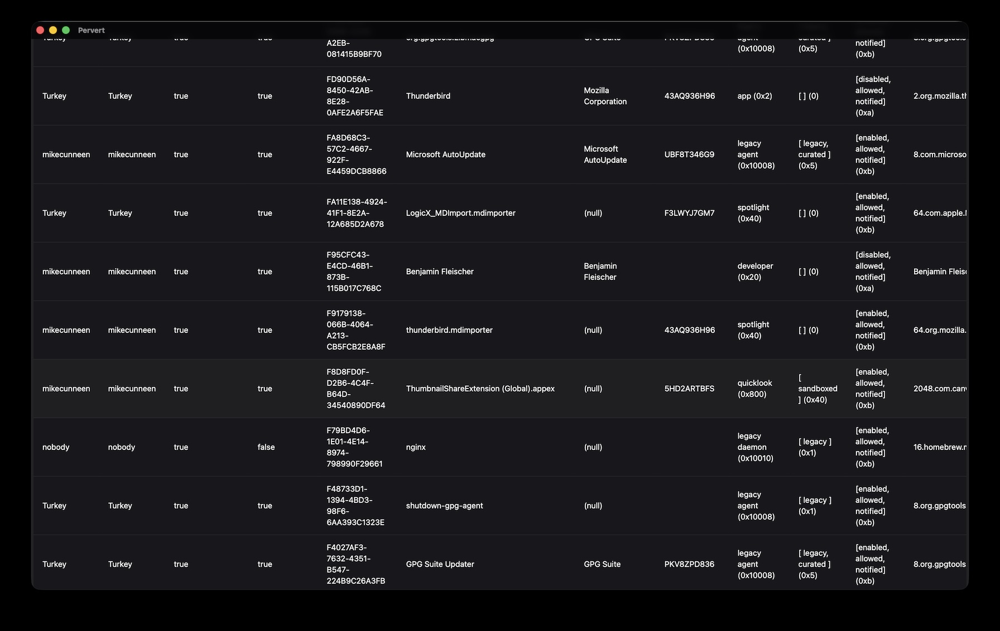

<a id="readme-top"></a>

<div align="center" style="box-sizing: border-box;">

<span style="">_"Take a peek under your Mac"_</span>

<!-- PROJECT SHIELDS -->

[![Contributors][contributors-shield]][contributors-url]
[![Forks][forks-shield]][forks-url]
[![Stargazers][stars-shield]][stars-url]
[![Issues][issues-shield]][issues-url]
[![MPL-2.0][license-shield]][license-url]

</div>

<!-- PROJECT LOGO -->
<br />
<div align="center">
  <a href="https://github.com/cunneen/pervert">
  
  </a>
<h3 align="center">Pervert</h3>

  <p align="center">
    GUI for viewing MacOS service details
    <br />
    <a href="https://github.com/cunneen/pervert"><strong>Explore the docs »</strong></a>
    <br />
    <br />
    <a href="https://github.com/cunneen/pervert/issues/new?labels=bug&template=bug-report---.md">Report Bug</a>
    &middot;
    <a href="https://github.com/cunneen/pervert/issues/new?labels=enhancement&template=feature-request---.md">Request Feature</a>
  </p>
</div>

<!-- TABLE OF CONTENTS -->
<details>
  <summary>Table of Contents</summary>
  <ol>
    <li>
      <a href="#about-the-project">About The Project</a>
      <ul>
        <li><a href="#built-with">Built With</a></li>
      </ul>
    </li>
    <li>
      <a href="#getting-started">Getting Started</a>
      <ul>
        <li><a href="#prerequisites">Prerequisites</a></li>
        <li><a href="#installation">Installation</a></li>
      </ul>
    </li>
    <li><a href="#usage">Usage</a></li>
    <li><a href="#roadmap">Roadmap</a></li>
    <li><a href="#contributing">Contributing</a></li>
    <li><a href="#license">License</a></li>
    <li><a href="#acknowledgments">Acknowledgments</a></li>
  </ol>
</details>

<!-- ABOUT THE PROJECT -->

## About The Project

<a href="./public/2026-08-28_screenshot.jpg" title="full screenshot"></a>

A GUI to explore MacOS processes and their configuration; largely a front-end for the built-in MacOS
`sfltool`.


### Background

The motivation arose when I was troubleshooting an issue on my Mac caused by an errant 3rd-party application.

The application tended to corrupt the network stack, leaving my computer largely inoperable. Worse still, uninstalling
the application didn't solve the problem: the application had installed a kernel network
extension, and a persistent service which kept re-corrupting the network config.

Trying to figure this all out, and then fix it, was a nightmare. It turns out there are so many places and applications on a Mac where
the configuration for such items reside:

- `launchctl`
- `configd` (`scutil`)
- Shared-File Lists (`sfltool`)
- `homebrew`
- `/etc/`
- `ifconfig` , `route`
- ...

The goal of this project is to (eventually) be:

| _"The only tool you need in order to manage your Mac"_ |
|--------------------------------------------------------|

<p align="right">(<a href="#readme-top">back to top</a>)</p>

### Built With


[ ![HeroUI] ][heroui-link]
![macOS] 
[ ![Node.js] ][Node.js-link]
[ ![npm] ][npm-link]
[ ![React.js] ][React.js-link]
[ ![rust] ][Rust-link]
[ ![tanstack] ][tanstack table]
[ ![Tauri] ][Tauri-link]
[ ![Vite] ][Vite-link]
[ ![Vitest] ][Vitest-link]
[ ![Visual Studio Code] ][vscode-link]

<p align="right">(<a href="#readme-top">back to top</a>)</p>

<!-- GETTING STARTED -->

## Getting Started

1. Clone the repo
   ```sh
   git clone https://github.com/cunneen/pervert.git
   ```
2. Install NPM packages
   ```sh
   npm install
   ```

3. Run the app
   ```sh
   npm run start dev
   ```

### In the Future...

In the future you'll be able to install and run the app:

- from the command line, e.g.:
  ```sh
  npx pervert
  ```
- from homebrew e.g.:
  ```sh
  brew install pervert
  ```

<p align="right">(<a href="#readme-top">back to top</a>)</p>

<!-- USAGE EXAMPLES -->

## Usage

<!-- TODO: add usage examples -->

Coming soon...

<p align="right">(<a href="#readme-top">back to top</a>)</p>

<!-- ROADMAP -->

## Roadmap

- [ ] Nice display of `sfltool dumpbtm` output -- *80% complete*
- [ ] UI to backup config
  - Automatically store incremental backups (optionally)
- [ ] UI to restore config
- [ ] UI to remove a configured service
- [ ] Nice top-level display of active services ( / agents / daemons etc)
  - as per [Lingon Pro][Lingon Pro] and [LaunchControl][LaunchControl]
- [ ] Display cross-referenced service config with active services
- [ ] "Drill-down" into active service details
  - again, as per [Lingon Pro][Lingon Pro] and [LaunchControl][LaunchControl]
- [ ] UI to display open files, ports and sockets
  - as per [Sloth]
- [ ] UI to display running processes
  - as per MacOS built-in Activity Monitor
- [ ] UI to Add / Load / Enable / Disable / Unload / Remove services via `launchctl`
- [ ] UI to create a new service
  - write a `plist` to `${HOME}/Library/LaunchAgents` and load it via `launchctl`
- [ ] Nice display of `configd` state (via `sctool`)
- [ ] Manipulation of `configd` state (via `sctool`)
- [ ] UI display of installed packages
  - as per [Cork][Cork], [Applite][Applite]
- [ ] UI front-end to install / update / remove Homebrew and App Store packages
  - as per [Cork][Cork], [Applite][Applite]

See the [open issues](https://github.com/cunneen/pervert/issues) for a full list of proposed features (and known issues).

<p align="right">(<a href="#readme-top">back to top</a>)</p>

<!-- CONTRIBUTING -->

## Contributing

Contributions are what make the open source community such an amazing place to learn, inspire, and create. Any contributions you make are **greatly appreciated**.

If you have a suggestion that would make this better, please fork the repo and create a pull request. You can also simply open an issue with the tag "enhancement".
Don't forget to give the project a star! Thanks again!

1. Fork the Project
2. Create your Feature Branch (`git checkout -b feature/AmazingFeature`)
3. Commit your Changes (`git commit -m 'Add some AmazingFeature'`)
4. Push to the Branch (`git push origin feature/AmazingFeature`)
5. Open a Pull Request

<p align="right">(<a href="#readme-top">back to top</a>)</p>

### Top contributors:

<a href="https://github.com/cunneen/pervert/graphs/contributors">
  
</a>

<!-- LICENSE -->

## License

Distributed under the MPL-2.0 License. See `LICENSE.md` for more information.

<p align="right">(<a href="#readme-top">back to top</a>)</p>

<!-- ACKNOWLEDGMENTS -->

## Acknowledgments

These modules are used directly. Many thanks to the creators and maintainers:

- [@vscode/sudo-prompt]
- [tanstack table]

These applications are genuinely useful, and have inspired various aspects:

- [Cork]
- [LaunchControl]
- [Lingon Pro]
- [Sloth]

<p align="right">(<a href="#readme-top">back to top</a>)</p>

<!-- MARKDOWN LINKS & IMAGES -->
<!-- https://www.markdownguide.org/basic-syntax/#reference-style-links -->

[contributors-shield]: https://img.shields.io/github/contributors/cunneen/pervert.svg?style=for-the-badge
[contributors-url]: https://github.com/cunneen/pervert/graphs/contributors
[forks-shield]: https://img.shields.io/github/forks/cunneen/pervert.svg?style=for-the-badge
[forks-url]: https://github.com/cunneen/pervert/network/members
[stars-shield]: https://img.shields.io/github/stars/cunneen/pervert.svg?style=for-the-badge
[stars-url]: https://github.com/cunneen/pervert/stargazers
[issues-shield]: https://img.shields.io/github/issues/cunneen/pervert.svg?style=for-the-badge
[issues-url]: https://github.com/cunneen/pervert/issues
[license-shield]: https://img.shields.io/github/license/cunneen/pervert.svg?style=for-the-badge
[license-url]: https://github.com/cunneen/pervert/blob/master/LICENSE.md

<!-- Shields.io badges. You can a comprehensive list with many more badges at: https://github.com/inttter/md-badges -->

[heroui]: https://img.shields.io/badge/HeroUI-000000?style=for-the-badge&logo=heroui&logoColor=ffffff "HeroUI"
[macOS]: https://img.shields.io/badge/macOS-000000?style=for-the-badge&logo=apple&logoColor=F0F0F0 "macOS"
[Node.js]: https://img.shields.io/badge/Node.js-6DA55F?style=for-the-badge&logo=node.js&logoColor=white "Node.js"
[npm]: https://img.shields.io/badge/npm-CB3837?style=for-the-badge&logo=npm&logoColor=fff "npm"
[React.js]: https://img.shields.io/badge/React-20232A?style=for-the-badge&logo=react&logoColor=61DAFB "React.js"
[Rust]: https://img.shields.io/badge/Rust-000000?style=for-the-badge&logo=rust&logoColor=ffffff "Rust"
[tanstack]: https://img.shields.io/badge/TanStack%20Table-ECE8D1?style=for-the-badge&logo=TanStack&logoColor=000000 "TanStack Table"
[Tauri]: https://img.shields.io/badge/Tauri-24C8D8?style=for-the-badge&logo=tauri&logoColor=fff "Tauri"
[Vite]: https://img.shields.io/badge/Vite-646CFF?style=for-the-badge&logo=vite&logoColor=fff "Vite"
[Vitest]: https://img.shields.io/badge/Vitest-6E9F18?style=for-the-badge&logo=vitest&logoColor=fff "Vitest"
[Visual Studio Code]: https://custom-icon-badges.demolab.com/badge/Visual%20Studio%20Code-0078d7.svg?style=for-the-badge&logo=visualstudiocode&logoColor=white "Visual Studio Code"

<!-- Links for Badges -->
[heroui-link]: https://heroui.com/  "HeroUI"
[Node.js-link]: https://nodejs.org/ "Node.js"
[npm-link]: https://npmjs.com/ "npm"
[React.js-link]: https://react.dev/ "React.js"
[Rust-link]: https://rust-lang.org/ "Rust"
[Tauri-link]: https://tauri.app/ "Tauri"
[Vite-link]: https://vite.dev/ "Vite"
[Vitest-link]: https://vitest.dev/ "Vitest"
[vscode-link]: https://code.visualstudio.com/ "Visual Studio Code"


<!-- Acknowledgements links -->

[@vscode/sudo-prompt]: https://github.com/microsoft/vscode-sudo-prompt#readme
[tanstack table]: https://tanstack.com/table/latest "TanStack Table"

<!-- Other links -->

[Applite]: https://github.com/milanvarady/Applite
[Cork]: https://github.com/buresdv/Cork
[LaunchControl]: http://www.soma-zone.com
[Lingon Pro]: https://www.peterborgapps.com/lingon/
[nodejs-url]: https://nodejs.org/en/download
[React-url]: https://reactjs.org/
[Sloth]: https://github.com/sveinbjornt/Sloth

<!-- images -->
[apple]: ./public/apple.svg "Apple Logo"
[error]: ./public/error.svg "Warning"

